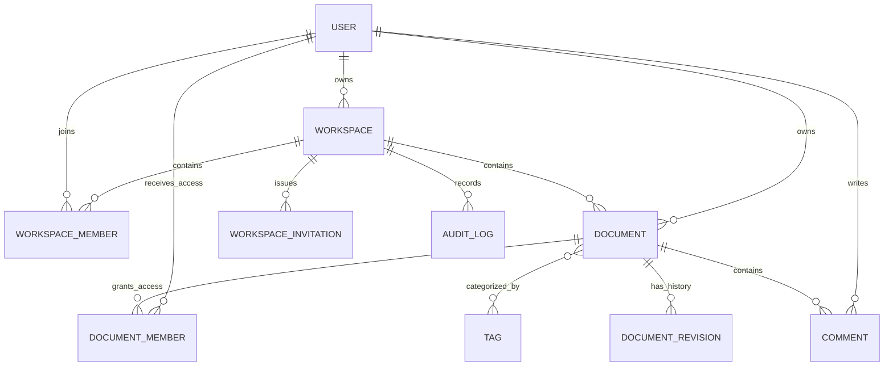

# Zeal

> A workspace-based collaborative document editor built with Next.js, Django, PostgreSQL, and WebSockets.

[](https://nextjs.org/)
[](https://www.djangoproject.com/)
[](https://www.postgresql.org/)
[](https://docs.docker.com/compose/)

Zeal lets people organize documents into personal or team workspaces, manage member permissions, edit rich-text content, and receive live updates through WebSockets. The full development stack runs in containers and works with OrbStack or any Docker Compose-compatible engine.

> [!NOTE]
> Zeal is under active development. Features and APIs may change.

## Highlights

- User registration and JWT-based authentication
- Automatic access-token renewal
- Email verification for new accounts
- Password-reset request and confirmation flow
- Refresh-token rotation, logout, and token blacklisting
- Automatic personal workspace creation
- Personal and team workspaces
- Workspace switching and document filtering
- Owner, admin, and member workspace roles
- Workspace member and role management
- Rich-text editing powered by Tiptap
- Create, view, edit, and delete documents
- Document tags, comments, and revision-history foundation
- Real-time document updates over WebSockets
- Live collaborator presence
- Owner, editor, and viewer permissions
- Role-based document sharing
- Read-only access for viewers
- Responsive Next.js interface
- Django administration
- Automated backend tests

## Workspaces

Every user receives a personal workspace when their account is created. Existing users and documents are also migrated automatically: each existing user receives a personal workspace, and their documents are assigned to it.

Users can:

- Switch between their available workspaces
- Create additional team workspaces
- Create documents in the selected workspace
- View only the documents in the active workspace
- Add existing Zeal users to a workspace by username
- Change member roles or remove members when authorized

Workspace permissions are:

| Role | Access |
| --- | --- |
| Owner | Full workspace access, including admin appointment and member removal |
| Admin | Edit workspace documents and manage regular members |
| Member | View documents in the workspace |

Only the owner can appoint administrators. Administrators cannot manage other administrators, and a user's personal workspace cannot be deleted.

## Architecture

```text
Browser
  │
  ├── HTTP :3000 ──► Next.js frontend
  │                     │
  │                     └── /api ──► Django REST API :8000
  │
  └── WebSocket :8000 ────────────► Django Channels
                                           │
                                           ▼
                                      PostgreSQL 17
```

Docker Compose creates three services:

| Service | Container | Purpose | Host port |
| --- | --- | --- | --- |
| `frontend` | `zeal-frontend` | Next.js development server | `3000` |
| `backend` | `zeal-backend` | Django, REST API, and Daphne | `8000` |
| `postgres` | `zeal-postgres` | PostgreSQL database | Internal only |

## Technology

| Layer | Tools |
| --- | --- |
| Frontend | Next.js, React, TypeScript, Tailwind CSS, Tiptap |
| Backend | Python, Django, Django REST Framework, Django Channels |
| Authentication | Simple JWT |
| Real-time transport | WebSockets served by Daphne |
| Database | PostgreSQL 17 |
| Local infrastructure | Docker Compose and OrbStack |

## Database design

PostgreSQL is the primary data store for users, authentication, workspaces, permissions, documents, tags, revisions, comments, invitations, and audit history.



Important database guarantees include:

- Unique user membership within each workspace
- Valid workspace and document roles
- Unique version numbers per document
- Non-empty comment bodies
- Unique pending invitations per workspace and email
- Atomic document creation and owner-membership creation
- Indexed workspace document, revision, comment, and audit queries

## Quick start

### Prerequisites

Install:

- [Git](https://git-scm.com/)
- [OrbStack](https://orbstack.dev/) or another Docker Compose-compatible engine

Confirm the container engine is running:

```bash
orb status
docker context show
docker compose version
```

When using OrbStack, `docker context show` should return `orbstack`.

### 1. Clone the repository

```bash
git clone https://github.com/Arnoldshaju/Zeal.git
cd Zeal
```

### 2. Build and start Zeal

```bash
docker compose up --build
```

Compose will:

1. Start PostgreSQL and wait for its health check.
2. Run Django database migrations.
3. Start the Django/Daphne backend.
4. Start the Next.js frontend.

Open [http://localhost:3000](http://localhost:3000), register an account, select your personal workspace, and create a document.

To run in the background:

```bash
docker compose up --build -d
docker compose ps
```

## Development commands

### Logs

```bash
# All services
docker compose logs -f

# One service
docker compose logs -f backend
docker compose logs -f frontend
docker compose logs -f postgres
```

### Django

```bash
# Configuration check
docker compose exec backend python manage.py check

# Database migrations
docker compose exec backend python manage.py migrate

# Test suite
docker compose exec backend python manage.py test

# Django administrator
docker compose exec backend python manage.py createsuperuser
```

The administration interface is available at [http://localhost:8000/admin/](http://localhost:8000/admin/).

### Frontend

```bash
# Lint
docker compose exec frontend npm run lint

# Production build check
docker compose exec frontend npm run build
```

### PostgreSQL

```bash
# Open the Zeal database
docker compose exec postgres psql -U zeal -d zeal
```

Useful commands inside `psql`:

```sql
\dt
\dt documents*
\dt workspaces*
```

Exit with:

```sql
\q
```

### Container lifecycle

```bash
# Stop and remove containers
docker compose down

# Rebuild after dependency or Dockerfile changes
docker compose up --build -d

# Restart one service
docker compose restart backend
```

> [!WARNING]
> `docker compose down -v` also deletes the PostgreSQL volume and all data stored in it.

## Project structure

```text
Zeal/
├── apps/
│   └── web/
│       ├── Dockerfile
│       ├── public/
│       └── src/
│           ├── app/             # Pages and routes
│           ├── components/      # UI and editor components
│           └── lib/             # API and collaboration clients
├── backend/
│   ├── collaboration/           # WebSocket consumers
│   ├── config/                  # Django configuration
│   ├── documents/               # Document models and API
│   ├── users/                   # Authentication and users
│   ├── workspaces/              # Workspaces, memberships, invitations, and audit logs
│   ├── Dockerfile
│   ├── manage.py
│   └── requirements.txt
├── database/
│   ├── README.md                # Database-project guide
│   ├── er-diagram.md            # Entity relationships
│   ├── reports.sql              # Ten PostgreSQL reports
│   ├── indexing-plan.md         # Index purposes and target queries
│   ├── transactions.md          # Transaction boundaries
│   └── backup-restore.md        # Backup and restore-test instructions
├── legacy/                      # Preserved earlier frontend
├── docker-compose.yml
└── README.md
```

## API overview

### Authentication

```text
POST /api/auth/register/
POST /api/auth/login/
POST /api/auth/refresh/
POST /api/auth/logout/
GET  /api/auth/me/

POST /api/auth/verify-email/request/
POST /api/auth/verify-email/confirm/
POST /api/auth/password-reset/request/
POST /api/auth/password-reset/confirm/
```

New accounts must verify their email before signing in. In local development,
Django uses its console email backend, so verification and password-reset links
appear in the backend logs. When Django debug mode is enabled, the request page
also displays an **Open local reset link** button:

```bash
docker compose logs -f backend
```

To send development email through Resend:

1. Create a sending API key in Resend.
2. Copy the email settings from `backend/.env.example` into `backend/.env`.
3. Set `EMAIL_BACKEND` to Django's SMTP backend and place the Resend API key in
   `EMAIL_HOST_PASSWORD`. Do not commit `backend/.env`.
4. Use `onboarding@resend.dev` while sending to the email associated with the
   Resend account. Verify a custom domain before sending to other users.
5. Restart the backend:

```bash
docker compose restart backend
```

Access tokens expire after 15 minutes. Refresh tokens expire after seven days,
rotate when used, and are blacklisted after rotation or logout. See
[`database/token-revocation.md`](database/token-revocation.md) for the complete
strategy and [`database/permission-matrix.md`](database/permission-matrix.md)
for authorization rules.

### Workspaces

```text
GET    /api/workspaces/
POST   /api/workspaces/
GET    /api/workspaces/{id}/
PATCH  /api/workspaces/{id}/
DELETE /api/workspaces/{id}/

GET    /api/workspaces/{id}/members/
POST   /api/workspaces/{id}/members/
PATCH  /api/workspaces/{id}/members/{user_id}/
DELETE /api/workspaces/{id}/members/{user_id}/
```

Create a workspace:

```json
{
  "name": "Engineering"
}
```

Add a member:

```json
{
  "username": "developer",
  "role": "MEMBER"
}
```

### Workspace documents

Filter documents by workspace:

```text
GET /api/documents/?workspace={workspace_id}
```

Create a document in a workspace:

```json
{
  "title": "Project Plan",
  "workspace": "workspace-uuid",
  "content": {
    "type": "doc",
    "content": []
  }
}
```

The backend rejects workspace IDs belonging to workspaces the authenticated user cannot access.

## Database learning project

The [`database/`](database/) directory contains the PostgreSQL project deliverables:

- ER diagram
- Ten reporting queries
- Indexing plan
- Transaction-boundary explanation
- Backup and restore instructions

Run all reports against the local database:

```bash
docker compose exec -T postgres \
  psql -U zeal -d zeal < database/reports.sql
```

Create a custom-format backup:

```bash
docker compose exec postgres pg_dump \
  -U zeal -d zeal -Fc -f /tmp/zeal.dump
```

## Environment and networking

Compose configures the development environment automatically:

```text
Frontend → http://backend:8000
Backend  → postgres:5432
Browser  → http://localhost:3000
Browser  → ws://localhost:8000
```

The checked-in Compose credentials are intended only for local development. Use secret management and strong unique credentials in any deployed environment.

## Troubleshooting

<details>
<summary><strong>Docker still uses Docker Desktop</strong></summary>

Start OrbStack and select its Docker context:

```bash
open -a OrbStack
docker context use orbstack
docker context show
```

</details>

<details>
<summary><strong>A port is already in use</strong></summary>

Stop any locally running Next.js or Django process, then restart Compose:

```bash
docker compose down
docker compose up --build
```

</details>

<details>
<summary><strong>Login returns 401 after resetting PostgreSQL</strong></summary>

Removing the PostgreSQL volume deletes its users. Clear stale browser authentication data and register a new account.

</details>

<details>
<summary><strong>Inspect service health and errors</strong></summary>

```bash
docker compose ps
docker compose logs backend
docker compose logs postgres
```

</details>

## Status

Zeal currently supports authentication, workspace organization, workspace membership management, document sharing, rich-text editing, comments, and real-time document updates.

The following foundations exist but still need complete user-facing workflows:

- Invitation email delivery and token acceptance
- Revision-history API and frontend
- Automatic revision creation for WebSocket edits
- Audit-log viewer
- Tag-management interface
- Production-grade real-time conflict resolution

Production hardening, broader automated coverage, and additional editing features remain ongoing work.
