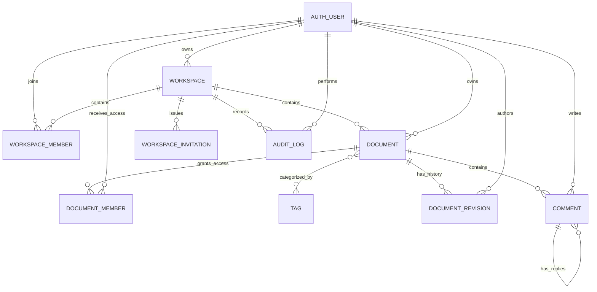

# Zeal database ER diagram

```mermaid
erDiagram
    AUTH_USER ||--o{ WORKSPACE : owns
    AUTH_USER ||--o{ WORKSPACE_MEMBER : joins
    WORKSPACE ||--o{ WORKSPACE_MEMBER : contains
    WORKSPACE ||--o{ DOCUMENT : contains
    AUTH_USER ||--o{ DOCUMENT : owns
    DOCUMENT ||--o{ DOCUMENT_MEMBER : grants_access
    AUTH_USER ||--o{ DOCUMENT_MEMBER : receives_access
    DOCUMENT }o--o{ TAG : categorized_by
    DOCUMENT ||--o{ DOCUMENT_REVISION : has_history
    AUTH_USER ||--o{ DOCUMENT_REVISION : authors
    DOCUMENT ||--o{ COMMENT : contains
    AUTH_USER ||--o{ COMMENT : writes
    COMMENT ||--o{ COMMENT : has_replies
    WORKSPACE ||--o{ WORKSPACE_INVITATION : issues
    WORKSPACE ||--o{ AUDIT_LOG : records
    AUTH_USER ||--o{ AUDIT_LOG : performs
```

`Document.workspace` is nullable during the transition so existing documents remain valid.
